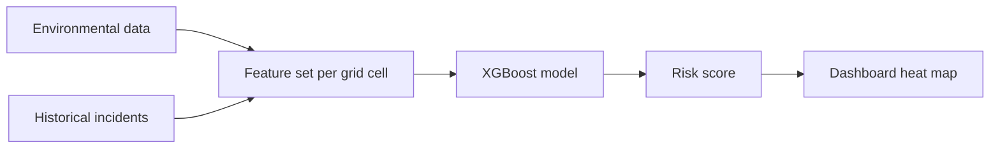

# AI and Prediction
## What the model does
TAHADHARI divides the park into 1 km × 1 km grid cells and predicts poaching risk for the next 48 hours. Each cell receives a probability between 0.00 and 1.00, stored in `risk_assessments` and displayed on the Commander dashboard as a colour-coded heat map.
## Model
**XGBoost classifier**

- Performs well on structured tabular data.
- Provides interpretable feature importance.
- Handles missing environmental data without failing.
- Suitable for combining environmental and historical incident features.
## Features

| Feature              | Source                           |Purpose                                                                          |
| -------------------- | -------------------------------- |-------------------------------------------------------------------------------- |
| NDVI                 | Google Earth Engine — NASA MODIS | Measures vegetation density and potential concealment                            |
| Rainfall             | OpenWeatherMap                   | Represents environmental conditions that may influence animal and human movement |
| Moon phase           | Astronomical data                | Represents night-time illumination                                               |
| Historical incidents | `reports` table                  | Three years of recorded snare and poaching incidents                             |

The model combines these environmental features with historical incident data to estimate risk for each grid cell.

## Risk bands
| Band   | Probability | Map colour |
| ------ | ----------- | ---------- |
| High   | >85%        | Red        |
| Medium | 50–85%      | Yellow     |
| Clear  | <50%        | Green      |

## Pipeline

