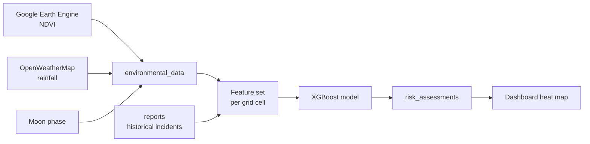

# AI and Prediction
## What the model does
TAHADHARI divides the park into 1 km × 1 km grid cells and predicts poaching risk for the next 48 hours. Each cell receives a probability between 0.00 and 1.00, stored in `risk_assessments` and displayed on the Commander dashboard as a colour-coded heat map.


## Features

| Feature              | Source                           |Purpose                                                                          |
| -------------------- | -------------------------------- |-------------------------------------------------------------------------------- |
| NDVI                 | Google Earth Engine — NASA MODIS | Measures vegetation density                           |
| Rainfall             | OpenWeatherMap                   | Represents environmental conditions that may influence animal and human movement |
| Moon phase           | Astronomical data                | Represents night-time illumination                                               


The model combines these environmental features with historical incident data to estimate risk for each grid cell.

## Risk bands
| Band   | Probability | Map colour |
| ------ | ----------- | ---------- |
| High   | >85%        | Red        |
| Medium | 50–85%      | Yellow     |
| Clear  | <50%        | Green      |


## Data

The model is trained on the [Wildlife Poaching Predictor dataset](https://www.kaggle.com/datasets/adityabhati02/wildlife-poaching-predictor-dataset) from Kaggle — 1,000 rows of grid-cell observations with environmental features and a risk label.

```python
import pandas as pd

data = pd.read_csv("wildlife_poaching_1000.csv")
data.info()
data.describe()
```

Download the CSV from the link above and place it beside the notebook, or pull it with the Kaggle CLI:

```bash
kaggle datasets download -d adityabhati02/wildlife-poaching-predictor-dataset
```

### Target selection

The dataset ships with two candidate targets, `poaching_incident` and `risk_level`. We use only `risk_level`.

`poaching_incident == 1` maps to exactly the same 20 rows as `risk_level == 'High'`. They are the same signal under two names, so keeping both would leak the target into the features. `poaching_incident` is dropped.

`risk_level` has three classes, collapsed to binary. The operational question is *"does this cell need a patrol?"*, which is high versus everything else.

```python
X = data.drop(columns=[
    'poaching_incident',   
    'risk_level',         
    'grid_id',            
    'last_poaching_days'   
])

risk_map = {'Low': 0, 'Medium': 0, 'High': 1}
y = data['risk_level'].map(risk_map)
```

### Class imbalance

Only 20 of 1,000 rows are high risk, roughly **2%**. This dominates every modelling decision that follows. A model that predicts "not high risk" for every cell scores 98% accuracy and is completely useless, so accuracy is not a metric we report.

## Train/test split

```python
from sklearn.model_selection import train_test_split

X_train, X_test, y_train, y_test = train_test_split(
    X, y, test_size=0.2, stratify=y, random_state=42
)
```

`stratify=y` is required. Without it, a random 20% split can easily land zero positive cases in the test set.

## Model
**XGBoost classifier**

- Performs well on structured tabular data.
- Provides interpretable feature importance.
- Handles missing environmental data without failing.
- Suitable for combining environmental and historical incident features.


**Three approaches**


**Class weighting** told the model to treat each positive as ~49 negatives. The model missed every threat, scoring a worse-than-random AUC-ROC of 0.4005.:

```python
model = xgb.XGBClassifier(scale_pos_weight=49, random_state=42)
model.fit(X_train, y_train)
```

**SMOTE plus a lowered threshold** was the second attempt. SMOTE generates synthetic minority examples to balance the training set, and lowering the decision threshold makes the model flag a cell on weaker evidence. At a 1% threshold this gave recall 1.00 and precision 0.02. That looks strong until you
read it operationally: the model flags nearly everything, so most patrols find nothing:


```python
from imblearn.over_sampling import SMOTE

smote = SMOTE(random_state=42)
X_train_balanced, y_train_balanced = smote.fit_resample(X_train, y_train)

model_smote = xgb.XGBClassifier(
    max_depth=3,
    learning_rate=0.05,
    subsample=0.8,
    colsample_bytree=0.8,
    random_state=42
)
model_smote.fit(X_train_balanced, y_train_balanced)

y_proba = model_smote.predict_proba(X_test)[:, 1]
preds = (y_proba >= 0.01).astype(int)
```


**Cross-validation** was the third step, because a single split containing only ~4 positives can't be trusted. With only 20 positive cases, a single train/test split is easily distorted by luck. To get an honest benchmark, a Stratified 5-Fold Cross-Validation was run:

```python
from sklearn.model_selection import StratifiedKFold

skf = StratifiedKFold(n_splits=5, shuffle=True, random_state=42)

for train_idx, test_idx in skf.split(X, y):
    fold_model = xgb.XGBClassifier(
        max_depth=3, learning_rate=0.05,
        subsample=0.8, colsample_bytree=0.8, random_state=42
    )
    fold_model.fit(X.iloc[train_idx], y.iloc[train_idx])
    y_proba = fold_model.predict_proba(X.iloc[test_idx])[:, 1]
```


## Data Pipeline



### Features

| Feature | Source | Purpose |
| --- | --- | --- |
| NDVI | Google Earth Engine — NASA MODIS | Vegetation density, a proxy for concealment |
| Rainfall | OpenWeatherMap | Environmental conditions influencing animal and human movement |
| Moon phase | Astronomical data | Night-time illumination |
| Historical incidents | `reports` table | Recorded snare and poaching incidents |

Environmental data is ingested per grid cell and written to `environmental_data`. Those features, combined with incident history, are scored by the model, and results are written to `risk_assessments`.

### Risk bands
The dashboard groups scores into three display bands:

| Band | Probability | Map colour |
| --- | --- | --- |
| High | Above 85% | Red |
| Medium | 50–85% | Yellow |
| Clear | Below 50% | Green |

These are display thresholds. The classifier's own decision threshold during evaluation was tuned much lower, at 0.01.

## Integration

**Input.** Inference is triggered by `POST /api/v1/risk/calculate`. The model reads features from `environmental_data` and labels from `reports`, both keyed by `grid_id`.

**Output.** Scores are written to `risk_assessments` and read by the dashboard via `GET /api/v1/risk/latest`, or per cell via `GET /api/v1/risk/grid/{grid_id}`.

**Authorisation.** Every risk endpoint requires a bearer token. Predicted hotspot locations are among the most sensitive data in the system — a leaked heat map tells a poaching operation exactly where enforcement expects activity.

**Anonymisation.** The model consumes only environmental measurements and incident records keyed by grid cell. No personal data, ranger identity, or GPS track enters the feature set, so predictions cannot be traced back to an individual ranger.

## Evaluation

Cross-validated results are the ones to trust.

| Metric | Mean | Range across folds |
| --- | --- | --- |
| High-risk recall (threshold 0.01) | 0.55 | 0.50 – 0.75 |
| AUC-ROC | 0.5724 | 0.5217 – 0.6556 |


**AUC-ROC 0.5724** — the model barely ranks high-risk cells
above low-risk ones. One fold scored 0.5217, which is effectively random.

**Recall 0.55** — even flagging most of the map, it catches about half the real high-risk cells.

## Known Limitations

The current model is an early baseline trained on a small public dataset. Cross-validated
AUC-ROC is 0.5724, which means it does not yet reliably separate high-risk cells from
low-risk ones. It should be treated as a working prototype rather than as patrol guidance
until it has been retrained on field data.

- **Limited training signal.** Only 20 of 1,000 rows are high risk. Performance is bounded by data volume rather than by model choice.
- **Trained on public data.** The model has not yet seen observations from the protected
  area itself. This is the main reason performance is low, and the main thing that changes
  as reports accumulate.
- **Unpatrolled cells look safe.** A cell with no report is either genuinely clear or never visited, and the model cannot tell the difference. Unvisited areas will never be flagged.
- **Poachers adapt.** Behaviour shifts in response to patrol patterns, so the model degrades over time.
- **Cloud cover blocks NDVI.** XGBoost tolerates the gap, but predictions weaken without a current reading.


## Future Improvements

1. **Retrain on real field reports.** Every synced ranger report adds a genuine labelled example from the actual protected area. This matters more than any modelling change.
2. **Record patrol tracks.** Logging where rangers walked turns "no report" into a true negative label rather than an ambiguous one.
3. **Add spatial features.** Distance to park boundary, water, and settlements are computable
   from PostGIS data already available, and each is a plausible poaching driver.