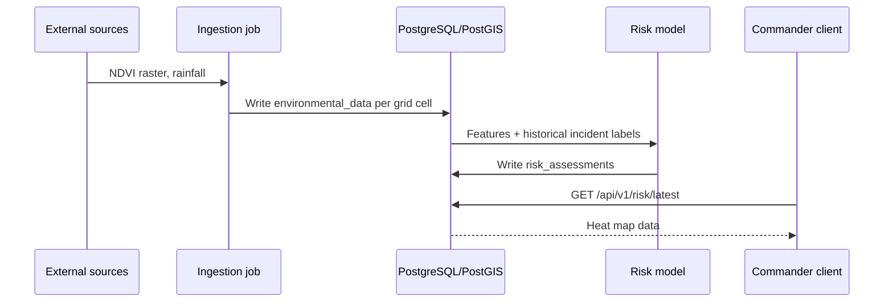
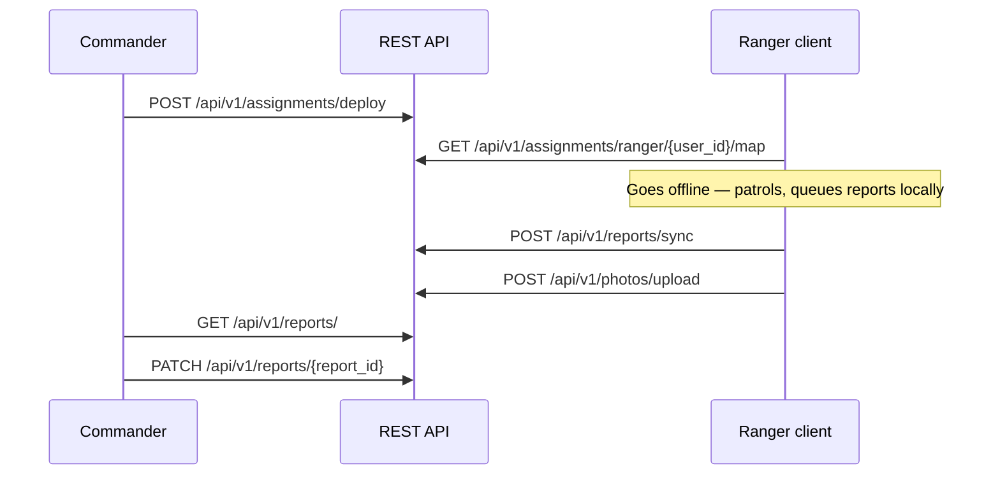

# Architecture

## System architecture diagram

TAHADHARI is a three-tier system — two clients, one API, one database — with a batch intelligence
pipeline attached that pulls in environmental data and writes back risk scores.

## System architecture with security controls

Security controls in the running system: bearer-token authentication on protected endpoints, closed
registration with no public signup, UUID identifiers throughout so nothing is enumerable, and TLS in
transit.

## Components

!!! note "Commander Web Client"

    - **Technology:** Next.js + TypeScript
    - **Does:** risk heat map, patrol assignment, report review
    - **Connects to:** the Backend API over HTTPS
    - **Reads:** `GET /api/v1/risk/latest`, `GET /api/v1/reports/`
    - **Writes:** `POST /api/v1/assignments/deploy`, `PATCH /api/v1/reports/{report_id}`

!!! note "Ranger Field Client"

    - **Technology:** offline-first client
    - **Does:** caches assigned grid cells and map tiles before leaving base, queues incident
      reports with no signal
    - **Connects to:** the Backend API intermittently; OpenStreetMap directly for tile caching
    - **Reads:** `GET /api/v1/assignments/ranger/{user_id}/map`
    - **Writes:** `POST /api/v1/reports/sync`, `POST /api/v1/photos/upload`

!!! note "Backend API"

    - **Technology:** Python + FastAPI
    - **Does:** the only component that touches the database
    - **Serves:** 29 endpoints under `/api/v1`, across 7 groups
    - **Auth:** OAuth2 password flow, JWT bearer tokens
    - **Also runs:** scheduled environmental ingestion and risk inference jobs
    - **Connects to:** both clients, the database, and all external sources

!!! note "Database"

    - **Technology:** PostgreSQL + PostGIS
    - **Stores:** grid cells and polygons, users, assignments, field reports, environmental
      telemetry, risk scores
    - **Connects to:** the Backend API only — no client reaches it directly
    - **Supplies:** features and labels to the Risk Model
    - **Receives:** scores back from the Risk Model into `risk_assessments`

!!! note "Risk Model"

    - **Technology:** XGBoost
    - **Does:** scores every 1 km × 1 km grid cell for poaching probability
    - **Reads:** environmental features and historical incident labels from the database
    - **Writes:** scores to `risk_assessments`
    - **Triggered by:** `POST /api/v1/risk/calculate`

!!! note "External Sources"

    - **Google Earth Engine** — NDVI vegetation index from NASA MODIS
    - **Weather API** — rainfall
    - **OpenStreetMap** — base map tiles and road networks
    - **Connects to:** the Backend API's ingestion jobs; OSM tiles also reach the Ranger Field
      Client directly for offline caching

!!! note "Hosting"

    - **Backend:** Heroku — `tahadhari-4157e9afb97a.herokuapp.com`
    - **Dashboard:** Vercel — `https://compil-her-dashboard.vercel.app/`

## How data flows

Two flows meet at the database. The intelligence flow produces predictions; the field flow produces
the ground truth those predictions are trained on.

### Intelligence flow — producing a risk score

Satellite NDVI, rainfall and moon phase are written per grid cell into `environmental_data`. Those
features plus historical incidents from `reports` are scored by the model, and the result — a
probability and a risk band per cell — is written to `risk_assessments`. The commander reads it via
`GET /api/v1/risk/latest`.

### Field flow — producing ground truth

The field client caches its assigned cells and map tiles before leaving base, writes reports to a
local queue while offline, and pushes that queue to `/api/v1/reports/sync` once connectivity
returns. Photos link separately, after the report exists. Full detail on the offline model is in
[Mobile](mobile.md).

## Related

- [Backend](backend.md) — the API surface in full
- [Mobile](mobile.md) — the offline sync model
