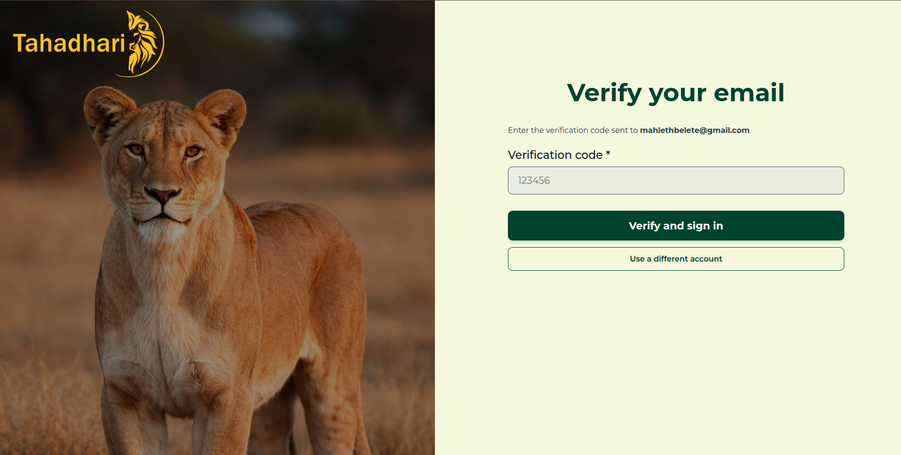

# Tahadhari Frontend

---

## Getting Started

To spin up this frontend workspace on your local machine, ensure you satisfy the basic tool requirements before initiating the local development server parameters.

### 1. Prerequisites

| Tool       | Version               |
| ---------- | --------------------- |
| Node.js    | 20.x LTS              |
| npm        | Included with Node.js |
| Git        | Recent version        |

### 2. Clone the Repositories
Pull down the project code from the remote repository branch:
```bash
git clone https://github.com
```

### 3. Local Workspace Optimization
Navigate directly into the root workspace folder, install the core node dependency tree, and map your environment variables:
```bash
cd Compil-HER_Dashboard
npm install
```
Create an uncommitted file structure named `.env.local` directly inside your project's root folder block. Paste the following variable routing token to hook up your client requests straight to your local running FastAPI system engine:
```env
NEXT_PUBLIC_API_URL=http://localhost:8000
```

Boot up the local hot-reloading Next.js live file compiler watcher:
```bash
npm run dev
```
Once your build sequence finishes successfully, open your web browser tool and go directly to `http://localhost:3000` to view the running application workspace.

---

##  Core Directory Architecture

We built a modular, clean directory tree utilizing the features of the **Next.js App Router** framework. Instead of clustering components into one file space, folders are structurally isolated. We use route groups like `(Auth)` to keep our gateway pages separate from the protected metrics views found inside our core dashboard panels.

```text
app/
├── (Auth)/                           # Secure Gateway Entry Workflows
│   └── login/                        
│       ├── login.css                 # Presentation layout rules for split panels
│       └── page.jsx                  # Multi-step authentication view router logic
├── dashboard/                        # Protected Mission Control Workspace
│   ├── data-analytics/               
│   │   ├── data-analytics.css        # Layout formatting constraints for map grids
│   │   ├── incident-distribution.jsx # Analytical chart reporting interfaces
│   │   ├── incidents-area.jsx        # Cluster tracking map overlay components
│   │   ├── incidents-trend.jsx       # Linear activity trend visualization tools
│   │   └── page.jsx                  # Core Operations analytics workspace
│   ├── home-page/                    
│   │   ├── home-page.css             
│   │   └── page.jsx                  # Commander default control deck
│   ├── HotSpot-Prediction/           
│   │   ├── HotSpot-Prediction.css    # Heatmap threat code values configuration
│   │   └── page.jsx                  # Machine learning spatial predictive map layout
│   ├── incident-report/              
│   │   ├── incident.css              
│   │   └── page.jsx                  # Live field report processing workspace
│   ├── manage-rangers/               
│   │   ├── manage-rangers.css        # Shift boards and status grids formatting
│   │   └── page.jsx                  # Ranger personnel deployment tracking matrix
│   ├── patrol-logs/                  
│   │   ├── patrol-logs.css           
│   │   └── page.jsx                  # Archival logging datatable interface
│   └── settings/                     
│       ├── change-pass.jsx           # Account password update management logs
│       ├── notification.jsx          # Event alert triggers and noise settings
│       ├── preferences.jsx           # Theme toggle sets and default configurations
│       └── settings.css              
├── layout.css                        # Frame-level application structure style sheet
├── layout.jsx                        # Master context layer wrapping system state stores
├── page.jsx                          # Public-facing Informational landing portal root
├── globals.css                       # Root system colors and Tailwind configuration tokens
└── favicon.ico                       
```

---

---

## The Multi-Step Authentication Gateway

The login interface operates as a clean, single-route user experience wizard. Instead of throwing resource heavy browser path redirects across different links, the layout tracks an internal component status variable to swap subcomponents inline.

### Visual Interface Split Design
The entry viewport separates the screen cleanly into two balanced zones. The left pane anchors our visual legacy using our gold-crest lion asset, while the right panel displays our sand-tinted interface controls.


When a user interacts with this login card, the system executes a secure two-step network contract sequence.

### Step 1: Initial Credentials Authentication
When the commander enters their login text data and clicks the "Continue" form action button, our code triggers a validation request to verify baseline account entry credentials.

* **API Target Endpoint**: `POST /api/v1/auth/login`
* **Transport Payload Envelope**: `application/json`

```json
{
  "email": "commander.tahadhari@domain.com",
  "password": "SecurePassword123"
}
```
```json
{
  "status": "success",
  "message": "Verification code dispatched to registered channel",
  "step_required": "two_factor_verify"
}
```

### Step 2: Multi-Factor Email Token Matching
As soon as the frontend receives confirmation from Step 1, the inner screen component state updates instantly. It replaces the input field layer with our email confirmation box so the commander can type their 6-digit access code without a single layout blink.



* **API Target Endpoint**: `POST /api/v1/auth/verify`
* **Transport Payload Envelope**: `application/json`

```json
{
  "email": "commander.tahadhari@domain.com",
  "verification_code": "123456"
}
```
```json
{
  "status": "authenticated",
  "token": "eyJhbGciOiJIUzI1NiIsInR5cCI6IkpXVCJ9...",
  "expires_in": 86400
}
```

Once this step evaluates successfully and the validation response registers a security JSON Web Token (JWT) in our system storage, the dashboard launches the user directly into their core workspace control engine.

---

## Repository Coding Standards

To ensure long-term code maintainability and prevent design clutter as our team grows, all commits targeting this frontend code asset branch must stick to these unified engineering rules:

* **Component Structures**: Code maps must always use **Functional React Components** alongside clean hook definitions to maximize UI performance.
* **Naming Topography Matrix**:
  * Use `camelCase` parameters for local state flags, scope functions, variables, and arrays.
  * Use `PascalCase` formatting for structural file names, master components, and layout wrappers.
  * Use `SCREAMING_SNAKE_CASE` exclusively when referencing static variables, configuration constants, or environment targets.
* **File Separation Rule**: Maintain **one component per file**. If a page relies on small, nested layout widgets, move them out into separate files inside that page module's directory path rather than building code elements inline.

---

##  The Continuous Deployment Pipeline

Our client compilation and version deployment workflow is entirely automated using Vercel. This gives us zero-downtime integration updates whenever team changes land safely on our primary code branch.

* **Target Production Platform**: Vercel Cloud Server Environment (Edge Execution Architecture)
* **Trunk Release Trigger**: Monitored continuous updates tied directly to the production `main` code branch.

* **Preview Pipeline Isolation**: Opening any Pull Request on GitHub automatically spins up a clean, isolated staging testing URL link. This allows engineering teams to perform visual audits and check design guideline compliance before merging any feature into production.

