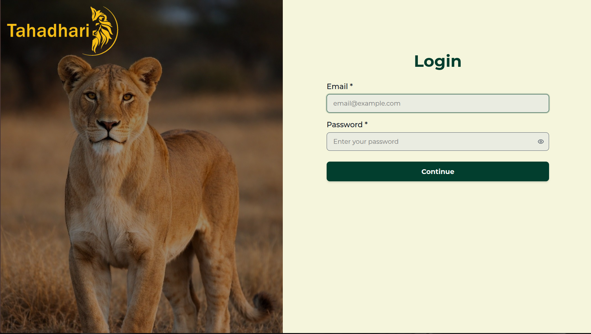
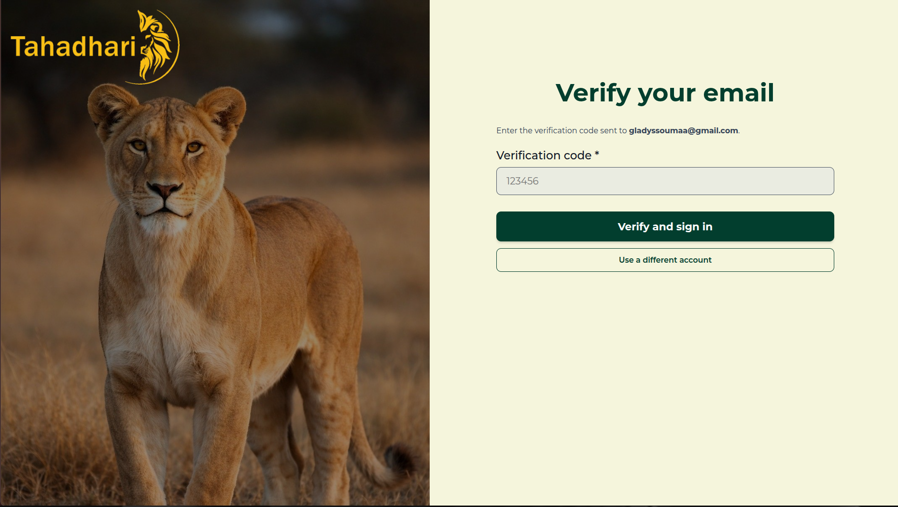
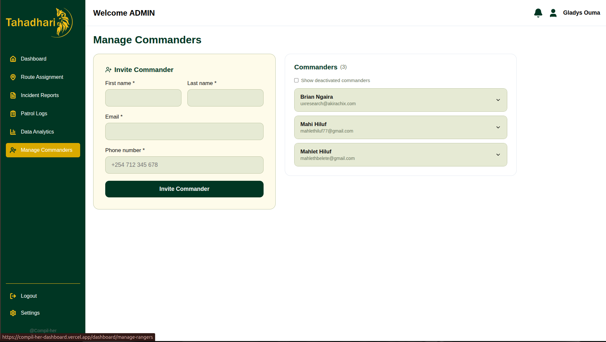
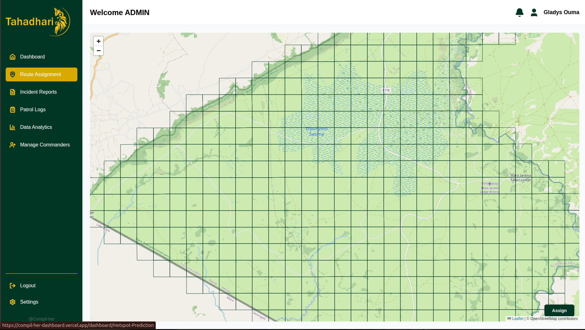
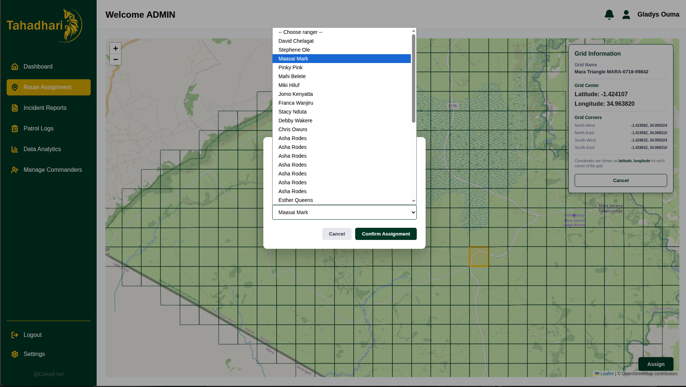
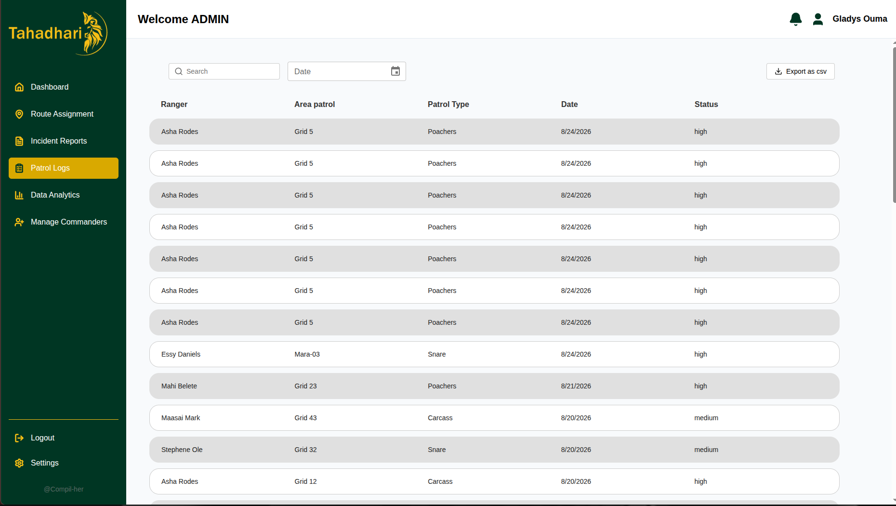
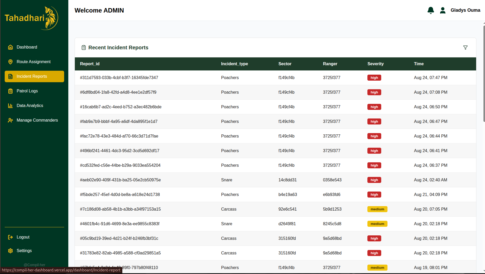
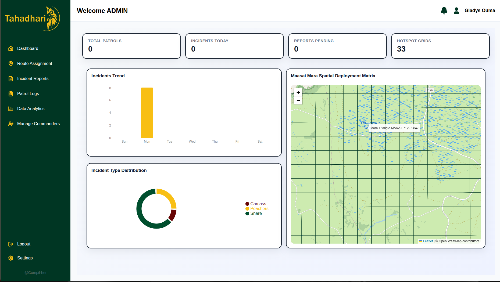

## Project Setup

This explains how the project was started, how to run the informational website and dashboard, how to clone the repository, how to install the required packages, how to create the initial boilerplate, how the code is organized.

The project contains two primary user-facing areas:

| Area                      | Purpose               |
| ----------                | --------------------- |
| Informational website     | Presents the project purpose features and public information           |
|Dashboard                  | Provides authenticated commanders access to application data and management features                 |

### Install the required tools

Install Git, Node.js, and npm and confirm that the tools are available before continuing.


| Package installation      |  Confirm Installation             |
| ----------                | --------------------- |
| npm install     | npm --version          |
|node install     |  node --version                 |

### Clone the repository
```bash
git clone https://github.com/akirachix/-Compil-HER_Informational_Website.git
git clone https://github.com/akirachix/Compil-HER_Dashboard.git
```
### Move into the project folder
```bash
cd Compil-HER_Dashboard
cd -Compil-HER_Informational_Website
```

### Install project dependencies
Install all packages listed in package.json.
```bash
npm install
```
### Create the boilerplate for the project
The boilerplate provides the initial application entry point, source directory, build configuration, and package scripts. 
```bash
npm create next-app@latest Compil-HER_Dashboard
npm create next-app@latest -Compil-HER_Informational_Website

```

### Setup command summary

|  Step | Command | Result |
| -------- | -------- | -------- |
| Clone | git clone repository-url | Downloads the repository|
| Enter repository| cd project-folder |Sets the working directory|
| Install packages | npm install | Installs dependencies|
| Create boilerplate |npm create next-app@latest <folder-name> | Creates the initial React structure|
| Start development | npm run dev | Runs the local development server.|

## Code Structure
### Overview
The application is organized by responsibility. 

 **Core Configuration Files**

* *package.json*: Manages project dependencies and scripts.eslint.
* *config.mjs*: Configures linting rules to maintain code quality
* *..gitignore*: Specifies files and folders for Git to ignore.
* *env.local* : Stores local environment variables securely.

 **Shared Directories**

* *components*: Houses reusable UI building blocks shared across different pages.

* *public*: Stores static assets such as images, logos, and custom fonts.
* *node_modules*: Contains all installed third-party npm packages.

**The root Directory**

This folder handles the application's routing, layouts, and global styles.

* *layout.jsx & page.jsx*: The main entry points defining the global layout and the landing/home page of the site.
* *globals.css*: Contains global styles applied across the entire application.

### Main directory Structure

**Dashboard**
```text
app/
├── (Auth)/
│   └── login/
│       ├── login.css
│       └── page.jsx
├── dashboard/
│   ├── data-analytics/
│   │   ├── data-analytics.css
│   │   ├── incident-distribution.jsx
│   │   ├── incidents-area.jsx
│   │   ├── incidents-trend.jsx
│   │   └── page.jsx
│   ├── home-page/
│   │   ├── home-page.css
│   │   └── page.jsx
│   ├── HotSpot-Prediction/
│   │   ├── Hotspot-Prediction.css
│   │   └── page.jsx
│   ├── incident-report/
│   │   ├── incident.css
│   │   └── page.jsx
│   ├── manage-rangers/
│   │   ├── manage-rangers.css
│   │   └── page.jsx
│   ├── patrol-logs/
│   │   ├── page.jsx
│   │   └── patrol-logs.css
│   ├── settings/
│   │   ├── change-pass.jsx
│   │   ├── notification.jsx
│   │   ├── page.jsx
│   │   ├── preferences.jsx
│   │   └── settings.css
│   ├── layout.css
│   ├── layout.jsx
│   └── page.jsx
├── favicon.ico
├── globals.css
├── layout.jsx
└── page.jsx
```
---


**Informational Website**
```text
├── public/              # Static assets (images, icons)
├── src/
│   ├── components/      # Reusable layout UI blocks
│   │   ├── Navbar.jsx   # Global responsive navigation header
│   │   ├── Footer.jsx   # Global navigation and resource footer
│   │   └── Card.jsx     # Reusable layout blocks for services and teams
│   ├── pages/           # Application entry points and route mappings
│   │   ├── index.jsx    # Home view
│   │   ├── about.jsx    # Project background and team profile view
│   │   └── services.jsx # Detailed system service breakdowns
│   └── styles/          # Global stylesheets and Tailwind configurations

```
---

### Environment variables
A **.env** file is used to **store sensitive data and configuration settings** outside of the main source code. It keeps private credentials like database passwords, API keys and encryption secrets out of the source code so they aren't accidentally shared or pushed to public repositories like GitHub.

It allows you to easily change settings depending on where the app is running without changing the code itself. The file is named .env.local. Next.js automatically detects this file and loads its variables into process.env. This file is automatically ignored by Git  so the private keys remain safe on your local machine.

## Informational Website
### 1. Landing Page

Introduces the project and directs visitors to the main areas of the website.

### 2. Services

Explains the services provided by the project.

### 3. About Us

Presents background information about the project and its team or organization.


## Dashboard

### 1. Commander Login

**Login implementation**
This snippet defines the login page for the application. It allows a user to enter an email address and password, sends those credentials to the backend, checks the response, stores the login information, and redirects authorized users to the dashboard.

The useForm hook manages the login form. The register function connects the email and password inputs to the form system. handleSubmit processes the form submission, and errors contains any validation errors. The  "onSubmit" means that validation is performed when the user submits the form.
The onSubmit function runs when the login form is submitted. It is asynchronous because it must wait for a response from the backend API.
The function sets isLoading to true so the interface can show that the login request is in progress. It also clears any previous API error by setting apiError to an empty string.

```
   
export default function LoginPage() {
  const [showPassword, setShowPassword] = useState(false);
  const [apiError, setApiError] = useState("");
  const [isLoading, setIsLoading] = useState(false);

  const router = useRouter();

  const {
    register,
    handleSubmit,
    formState: { errors },
  } = useForm({
    mode: "onSubmit",
  });

  const onSubmit = async (data) => {
    setIsLoading(true);
    setApiError("");

    try {
      const formBody = new URLSearchParams();
      formBody.append("username", data.email);
      formBody.append("password", data.password);

      const response = await fetch(
        `${process.env.NEXT_PUBLIC_API_URL}/api/v1/users/login`,
        {
          method: "POST",
          headers: {
            "Content-Type": "application/x-www-form-urlencoded",
          },
          body: formBody.toString(),
        },
      );

      const result = await response.json();

      if (!response.ok) {
        const message = Array.isArray(result.detail)
          ? result.detail[0]?.msg
          : result.detail;

        throw new Error(message || "Invalid email or password.");
      }

      const token = result.token || result.access_token;
      const role = result.role || result.user?.role;
      

      if (!token) {
        throw new Error("Login succeeded but no token was returned.");
      }

      const normalizedRole = role?.toLowerCase();

      if (normalizedRole === "admin" || normalizedRole === "commander") {
        localStorage.setItem("token", token);
        const userId = result.user?.user_id || result.user_id;

        if (userId) {
          localStorage.setItem("userId", userId);
        }
        if (role) {
          localStorage.setItem("role", role.toLowerCase());
        }
        router.push("/dashboard");
      } else {
        throw new Error("Invalid credentials");
      }
    } catch (error) {
      if (error instanceof TypeError) {
        setApiError("Unable to connect. Please try again.");
      } else {
        setApiError(error.message);
      }
    } finally {
      setIsLoading(false);
    }
  };
}

```


 **User Focused**: Authenticates commanders before they access dashboard features.

**Sample Request**
```
{
    "email": "admin12@example.com",
    "password" : "Password123@"
}
```




**Sample Response**
```
{
    "code": 123456,
    "mfa_token": "afeghftsesatuyrtd:vghxgxz:rwdytyfhfx"
}
```




**Sample Response**
```
{
    "access_token": "ERQWEFHGCE:VCFDXZC:GRATHGF",
    "role": "Commander"
}
```


### 2. Ranger Onboarding

**Onboarding Implementation**

Created several state variables to track data and status of the interface. The useForm hook manages the form used to add a ranger. The register function connects each input to React Hook Form and handleSubmit runs validation before calling the submission function. 
The loadRangers function retrieves the existing ranger records from the backend.
When the function starts, it sets isLoadingList to true and clears any previous list error. It then retrieves the authentication token from localStorage. This token is added to the request using the Authorization header in the format Bearer

```
"use client";

import { useState, useEffect } from "react";
import { useForm } from "react-hook-form";
import { ChevronDown, ChevronUp, Copy, Check, UserPlus } from "lucide-react";
import "./manage-rangers.css";

export default function ManageRangersPage() {
  const [rangers, setRangers] = useState([]);
  const [isLoadingList, setIsLoadingList] = useState(true);
  const [listError, setListError] = useState("");
  const [submitError, setSubmitError] = useState("");
  const [submitSuccess, setSubmitSuccess] = useState("");
  const [isSubmitting, setIsSubmitting] = useState(false);
  const [expandedId, setExpandedId] = useState(null);
  const [copiedId, setCopiedId] = useState(null);
  const [actioningId, setActioningId] = useState(null);
  const [showInactive, setShowInactive] = useState(false);

  const {
    register,
    handleSubmit,
    reset,
    formState: { errors },
  } = useForm({ mode: "onBlur" });

  const loadRangers = async () => {
    setIsLoadingList(true);
    setListError("");

    try {
      const token = localStorage.getItem("token");
      const response = await fetch(
        `${process.env.NEXT_PUBLIC_API_URL}/api/v1/users/rangers`,
        {
          headers: { Authorization: `Bearer ${token}` },
        },
      );

      const result = await response.json();

      console.log("Rangers API response:", result);

      if (!response.ok) {
        const message = Array.isArray(result.detail)
          ? result.detail[0]?.msg
          : result.detail;

        throw new Error(
          message || `Could not load ranger list. (${response.status})`,
        );
      }

      setRangers([...result].reverse());
    } catch (error) {
      console.error("Failed to load rangers:", error);
      const isNetworkFailure = error.message === "Failed to fetch";
      setListError(
        isNetworkFailure
          ? "Could not reach the server. Please check your connection and try again."
          : error.message,
      );
    } finally {
      setIsLoadingList(false);
    }
  };

  useEffect(() => {
    loadRangers();
  }, []);

  const onSubmit = async (data) => {
    setIsSubmitting(true);
    setSubmitError("");
    setSubmitSuccess("");

    try {
      const token = localStorage.getItem("token");
      const response = await fetch(
        `${process.env.NEXT_PUBLIC_API_URL}/api/v1/users/register`,
        {
          method: "POST",
          headers: {
            "Content-Type": "application/json",
            Authorization: `Bearer ${token}`,
          },
          body: JSON.stringify({
            first_name: data.first_name,
            last_name: data.last_name,
            email: data.email,
            phone: data.phone,
            password: data.password,
            role: "Ranger",
          }),
        },
      );

      const result = await response.json();

      if (!response.ok) {
        const message = Array.isArray(result.detail)
          ? result.detail[0]?.msg
          : result.detail;
        throw new Error(
          message ||
            "Unable to add ranger. Please check the information and try again.",
        );
      }
}
```

**User Focused**:  After successful authentication, the application redirects the commander to the dashboard.
The commander can add or register rangers and records their onboarding information.



### 3. View Hotspot grids

**Grid implementation**

The getGridCoordinates function receives one grid cell as its argument. The function converts the grid’s raw coordinate points into useful map coordinates. It checks whether a grid exists and whether it contains a gridDimension array. The optional chaining operators ?. prevent the code from crashing if cell or gridDimension is missing. If there are no coordinate points, the function returns null because there is not enough information to draw or position the grid.

```
function getGridCoordinates(cell) {
    if (!cell?.gridDimension?.length) {
      return null;
    }

    const coordinates = cell.gridDimension;

    const latitudes = coordinates.map((point) => Number(point[0]));

    const longitudes = coordinates.map((point) => Number(point[1]));

    const south = Math.min(...latitudes);
    const north = Math.max(...latitudes);

    const west = Math.min(...longitudes);
    const east = Math.max(...longitudes);

    const centerLatitude = (south + north) / 2;
    const centerLongitude = (west + east) / 2;

    return {
      northWest: [north, west],
      northEast: [north, east],
      southWest: [south, west],
      southEast: [south, east],
      center: [centerLatitude, centerLongitude],
    };
  }

  function handleAssignClick() {
    if (!selectedCell) {
      setError("Please select a grid first.");
      return;
    }

    setSelectedRanger("");
    setMessage("");
    setError("");
    setShowAssignModal(true);
  }

  const gridCoordinates = getGridCoordinates(selectedCell);

```

Displays hotspot grid information for monitoring and operational planning. The sqaures are gridded by 1km. Hotspot grids are pulled from the backend and displayed on a map on the frontend.




### 4. Patrol route assignment
**Assignment IMplementation**

The handleAssignClick function runs when the commander clicks the button to assign a patrol or ranger to a grid. If no grid is selected, the function displays an error and stops. This prevents the application from opening an assignment form that does not know which grid should receive the assignment. The function performs two validation checks before making the request. It verifies that a grid is still selected and then checks whether a ranger has been selected.

```
async function handleConfirmAssignment() {
    if (!selectedCell) {
      setError("No grid has been selected.");
      return;
    }

    if (!selectedRanger) {
      setError("Please select a ranger.");
      return;
    }

    try {
      setAssigning(true);
      setError("");
      setMessage("");

      const token = localStorage.getItem("token");

      if (!token) {
        setError("You are not authenticated.");
        return;
      }

      const payload = {
        grid_id: selectedCell.id,
        user_id: selectedRanger,
      };

      console.log("Deploying patrol assignment:", payload);

      const response = await fetch(
        `${process.env.NEXT_PUBLIC_API_URL}/api/v1/assignments/deploy`,
        {
          method: "POST",
          headers: {
            Authorization: `Bearer ${token}`,
            "Content-Type": "application/json",
          },
          body: JSON.stringify(payload),
        },
      );

      const data = await response.json();

      if (!response.ok) {
        throw new Error(data?.detail || "Failed to deploy patrol assignment.");
      }

      console.log("Assignment successfully created:", data);

      setMessage(`${selectedCell.gridName} has been assigned successfully.`);

      setShowAssignModal(false);
      setSelectedRanger("");
    } catch (err) {
      console.error("Assignment failed:", err);

      setError(err.message || "Failed to assign ranger.");
    } finally {
      setAssigning(false);
    }
  }

  function handleCancel() {
    setShowAssignModal(false);
    setSelectedRanger("");
    setError("");
  }

```
Assigns patrol routes to rangers or patrol teams based on risk levels and priority.



### 5. View Reports

**Report Implementation**

The code loads patrol reports from the backend, converts them into a format suitable for display, filters them by search text and date, and allows the filtered results to be exported as a CSV file.

```
useEffect(() => {
    const fetchLogs = async () => {
      try {
        const authToken = localStorage.getItem("token");
        if (!authToken) {
          setError("You are not authenticated. Please log in again.");
          setLoading(false);
          return;
        }
        const res = await fetch(
          `${process.env.NEXT_PUBLIC_API_URL}/api/v1/reports`,
          {
            method: "GET",
            headers: {
              Authorization: authToken ? `Bearer ${authToken}` : "",
              "Content-Type": "application/json",
            },
          },
        );
        if (!res.ok) {
          if (res.status >= 500) {
            throw new Error(
              "Server error. The patrol log service is currently down.",
            );
          }
        }

        if (res.ok) {
          const data = await res.json();
          const mappedLogs = data.map((item, index) => ({
            id: item.report_id || index,
            ranger: item.user_name,
            areaPatrol: item.grid_name,
            patrolType: item.incident_type,
            date: new Date(item.report_date).toLocaleDateString(),
            status: item.severity_level,
          }));
          setLogs(mappedLogs);
        }
      } catch (err) {
        console.error("Failed to load patrol logs:", err);

        if (err.message.includes("Failed to fetch")) {
          setError(
            "Network error. Please check your internet connection and try again.",
          );
        } else {
          setError("An unexpected error occurred while loading logs:", err);
        }
      } finally {
        setLoading(false);
      }
    };
    fetchLogs();
  }, [selectedDate]);

  const filteredLogs = logs.filter((log) => {
    const matchesSearch =
      log.ranger?.toLowerCase().includes(searchQuery.toLowerCase()) ||
      log.areaPatrol?.toLowerCase().includes(searchQuery.toLowerCase()) ||
      log.status?.toLowerCase().includes(searchQuery.toLowerCase()) ||
      log.patrolType?.toLowerCase().includes(searchQuery.toLowerCase());

    const matchesDate = selectedDate === "" || dayjs(log.date).format("YYYY-MM-DD") === selectedDate;
      
    return matchesSearch && matchesDate;
  });

```

The commander is able to view reports submitted by rangers. Filter by date, severity and status.





### 5. View KPIs

**Data analytics Implementation**

Displays key performance indicators used to monitor project performance. The request uses the GET method to retrieve data. It includes the commander’s token and identifies the request as using JSON. The function requests both the ranger list and the patrol reports because it needs information from both sources to calculate the dashboard statistics and metrics.

```
async function getDashboardSummary() {
      try {
        const token = localStorage.getItem("token");
        const user_id = localStorage.getItem("userId");

        const rangersResponse = await fetch(
          `${process.env.NEXT_PUBLIC_API_URL}/api/v1/users/rangers`,
          {
            method: "GET",
            headers: {
              Authorization: `Bearer ${token}`,
              "Content-Type": "application/json",
            },
          },
        );

        const reportsResponse = await fetch(
          `${process.env.NEXT_PUBLIC_API_URL}/api/v1/reports/`,
          {
            method: "GET",
            headers: {
              Authorization: `Bearer ${token}`,
              "Content-Type": "application/json",
            },
          },
        );

        if (!reportsResponse.ok || !rangersResponse.ok) {
          console.error("Failed to fetch dashboard summaries");
          return;
        }

        const rangers = await rangersResponse.json();
        const reports = await reportsResponse.json();

        if (Array.isArray(rangers)) {
          const activeRangersCount = rangers.filter(
            (ranger) => ranger.is_active === true,
          ).length;

          setActiveRangers(activeRangersCount);
        } else {
          setActiveRangers(0);
        }

        const todayString = new Date().toDateString();

        if (Array.isArray(reports)) {
          let totalArrests = 0;
          let totalAnimalsCaught = 0;
          let totalIncidentsToday = 0;

          reports.forEach((report) => {
            const reportDateStr =
              report.created_at || report.date || report.report_date;
            if (!reportDateStr) return;

            const isToday =
              new Date(reportDateStr).toDateString() === todayString;

            if (isToday) {
              totalIncidentsToday++;

              if (report.arrests_made || report.arrests) {
                totalArrests += Number(
                  report.arrests_made || report.arrests || 0,
                );
              }

              if (
                report.animals_caught ||
                report.animals ||
                report.trapped_animals
              ) {
                totalAnimalsCaught += Number(
                  report.animals_caught ||
                    report.animals ||
                    report.trapped_animals ||
                    0,
                );
              }
            }
          });

          setArrestsMade(totalArrests);
          setIncidentsReported(totalIncidentsToday);
          setAnimalsCaught(totalAnimalsCaught);
        }
      } catch (error) {
        console.error("Summary layout error:", error);
      }
    }
    getDashboardSummary();

    const interval = setInterval(
      () => {
        getDashboardSummary();
      },
      5 * 60 * 1000,
    );

    return () => clearInterval(interval);
  }, [];

```




## Website and dashboard distinction

|  Feature | Informational website | Dashboard |
| -------- | -------- | -------- |
| Main purpose| Explains the project and its features | Provides application functionality|
| Access| Public |Requires authentication|
| Layout |Website navigation and marketing content | Sidebar, header, and application content|
| Data |General public information| User-specific and restricted data|

## Quality ASsurance
### Playwright E2E Testing

Playwright provides browser testing for critical user journeys across Chromium, Firefox, and WebKit. The authentication test suite runs on all three browsers, testing login, signup, and password reset. The Expert PWA test suite tests offline functionality and form submission across all browsers. The Supervisor Dashboard test suite tests map rendering, charts, and data tables across all browsers.


### Jest Unit Testing

Jest is used for unit testing of components, utilities, and hooks. The components test suite covers rendering, props, events, and state management. The hooks test suite covers custom hook behavior and side effects. The utils test suite covers helper functions and data transformations. The API client test suite covers request building, error handling, and response parsing.

### Test Environment Setup

The test environment is configured to support all testing activities. For local development, developers install dependencies, run the application in development mode, and execute tests locally. In the CI/CD pipeline, tests are automatically executed on every push and pull request, ensuring that issues are caught early in the development process.


### Performance Testing

Ensures the application meets response time and resource usage targets. Page load performance is measured using Lighthouse. API response times are measured using custom performance tests. Resource usage is measured to ensure the application is efficient. Each test type has defined thresholds that must be met for the application to be considered performant.

### Test Logs and Evidence

For detailed step-by-step test executions and evidence records, refer to the following documents:

[QA Test Case Workbook](https://docs.google.com/spreadsheets/d/1fogQ_pSb-qqHlyMv2VX3V2Qc7zdU2POuIUFAObEg6s0/edit?usp=sharing)

[Informational Website TDD Test](https://github.com/akirachix/-Compil-HER_Informational_Website/blob/feature/testCompil_Her/compil-Her-test-script.cy.js)

[Dashboard Playwright Tests](https://github.com/akirachix/Compil-HER_Dashboard/feature/tahadhari.spec.js)

### Bug reporting Template

 When a bug is found, a detailed bug report is created. The report includes the bug title, severity level, environment, steps to reproduce, expected result, actual result, screenshots or logs, browser or device information, reporter name, and date. This template ensures that bugs are reported consistently and can be reproduced by developers.

## Deployment
### Vercel Deployment

The frontend is deployed to Vercel for production hosting. Vercel provides automatic deployments from the main branch, preview deployments for pull requests, and edge network distribution for fast global performance.

**Deployment Configuration**
```
{
  "buildCommand": "npm run build",
  "outputDirectory": ".next",
  "devCommand": "npm run dev",
  "installCommand": "npm install",
  "framework": "nextjs",
  "regions": ["iad1", "cdg1", "sin1"],
  "env": {
    "NEXT_PUBLIC_API_URL": "https://tahadhari-4157e9afb97a.herokuapp.com/"
  }
}

```
**Environment Variables in Production**

Environment variables must be configured in the Vercel dashboard. The following variables should be set for production:

|  Variable | Value | Purpose |
| -------- | -------- | -------- |
| NEXT_PUBLIC_API_URL | Production API URL | Backend Communication|

**Deployment Commands**

```
# Deploy to production
vercel --prod

# Deploy to preview
vercel

# View deployment logs
vercel logs

# List all deployments
vercel list

```


## Code Standards
* **Components**: Always use functional components for consistency and performance.
* **Naming**:
camelCase for variables and functions
PascalCase for component names
SCREAMING_SNAKE_CASE for constants
* **Files**: One component per file. Group by feature/module for maintainability.
* **Testing**: Use Jest, playwright and React Testing Library for unit tests; add tests for each new component or logic.
**Styling**: Tailwind CSS only. Avoid inline styles unless absolutely necessary.
* **Accessibility**: All UI should meet WCAG AA standards. Use semantic HTML and aria attributes.

