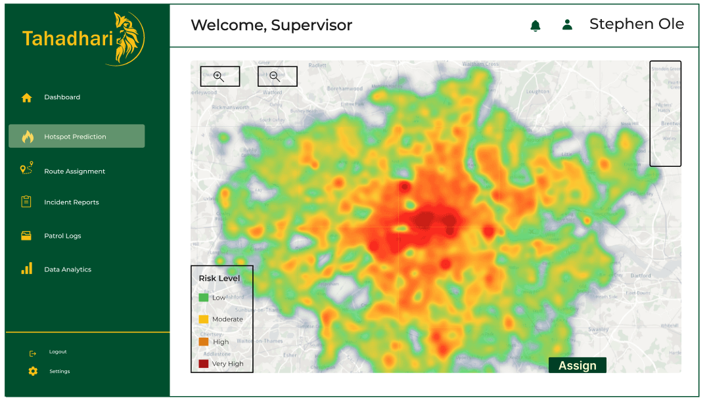
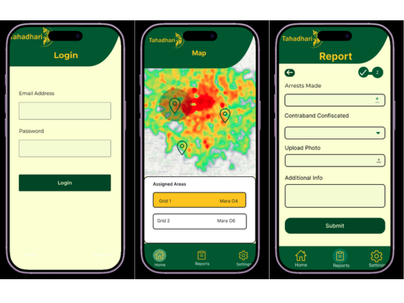
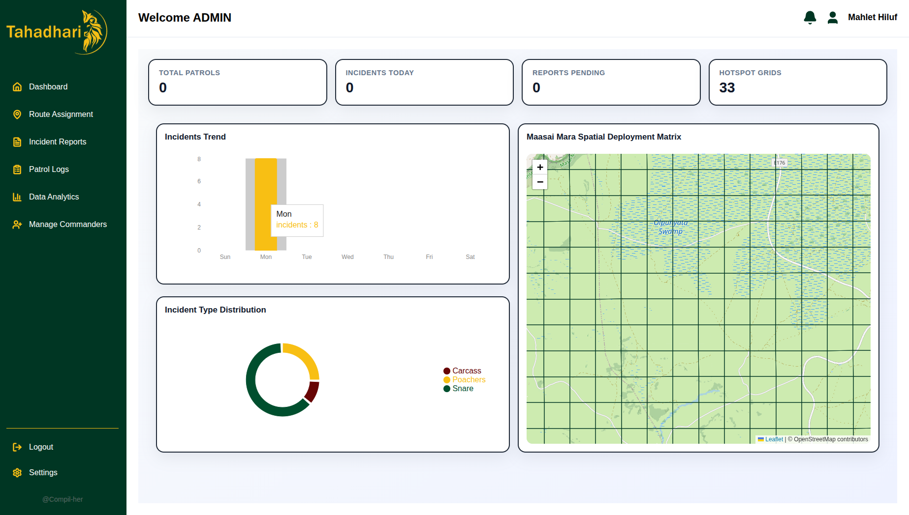

# **Welcome to Tahadhari**
Turning conservation data into smarter patrol decisions.
--------------------------------------------------------------------------

<a class="tah-website" href="https://compil-her-informational-website.vercel.app/" target="_blank" rel="noopener">
  Visit the TAHADHARI Website →
</a>

<

## Technology for Smarter Wildlife Protection

Turning conservation data into proactive patrol decisions.

TAHADHARI is an offline-first conservation intelligence and patrol prioritisation platform. It brings together patrol history, incident reports, community intelligence, satellite data, and environmental conditions to support smarter patrol decisions.

Designed for the realities of the field, TAHADHARI continues working when cellular connectivity is unavailable, allowing rangers to record information offline and synchronise it when connectivity returns.

## Our Platforms

## Key Features

### :material-map-marker-radius:

**Predictive Risk Mapping**

Identify areas of elevated poaching risk and support data-informed patrol prioritisation.

### :material-wifi-off:

**Offline-First Field Operations**

Record patrols and incidents without cellular connectivity and synchronise when a connection returns.

### :material-satellite-variant:

**Environmental Intelligence**

Use satellite and environmental data alongside historical conservation information to assess risk.

### :material-map-marker-radius:

**Patrol Prioritisation**

Turn risk intelligence into actionable patrol assignments for field teams.

### :material-camera-outline:

**Incident Evidence**

Capture incident information and photographic evidence directly from the field.

### :material-account-group:

**Commander & Ranger Platform**

Connect command-level decision making with ranger operations through web and mobile applications.

