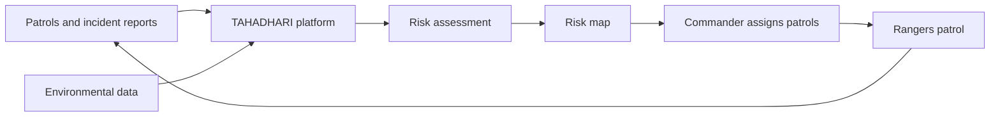

# Overview

## What is TAHADHARI?

TAHADHARI is a conservation intelligence platform that helps wildlife protection teams decide **where to patrol and what to prioritize**.

Instead of relying only on previous incidents or a commander's intuition, TAHADHARI combines historical patrol and incident data with environmental information to identify areas that may have a higher risk of poaching activity.

Commanders use the platform to review risk information and assign patrols. Rangers use the field application to receive assignments, patrol their areas, and record what they find.

The system is designed for conservation environments where internet connectivity may be unavailable for long periods.

---

## The problem TAHADHARI solves

Wildlife protection teams often have limited personnel, large areas to cover, and incomplete information about where poaching activity may occur.

Traditional patrol planning can be heavily influenced by:

- where incidents happened previously,
- what rangers know from experience,
- which areas are easiest to reach, and
- information that may not reflect current environmental conditions.

This creates a difficult problem:

> **How do you decide where a limited number of rangers should patrol when you cannot patrol everywhere?**

TAHADHARI addresses this problem by turning available conservation data into actionable patrol priorities.

Instead of only asking:

> **"Where did poaching happen?"**

TAHADHARI helps teams ask:

> **"Where should we prioritize patrol attention?"**

---

## How TAHADHARI works

At a high level, TAHADHARI follows a continuous information loop:

